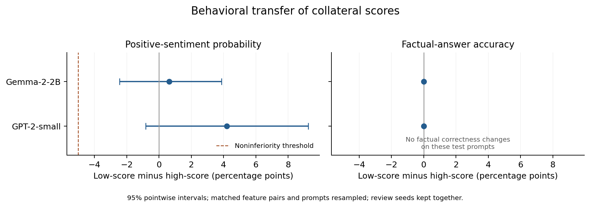

# Behavioral transfer of collateral scores

Completed results from the locally frozen September 18 protocol. This is an exploratory two-setting study of positive-sentiment steering and factual-retrieval preservation. No generated-output outcome was used to train the original collateral predictor. Development generations selected strength and matched feature pairs; all numbers below use held-out prompts.

## gpt2_small

The joint behavioral-transfer criterion is not met; report uncertainty and the observed tradeoff.

Coefficient 1; 6 low/high feature pairs; 6 random candidate features; 3,648 held-out outputs. Each feature has 64 review prompts with two seeds and 64 factual prompts. Development factual accuracy: 96.9%.

| Selector | Features | Positive probability | Positive rate | Positive and nondegenerate | Factual accuracy | Degenerate reviews |
|---|---:|---:|---:|---:|---:|---:|
| unsteered | 1 | 76.5% | 76.6% | 76.6% | 96.9% | 0.0% |
| low | 6 | 81.3% | 81.4% | 81.2% | 96.9% | 0.1% |
| high | 6 | 77.1% | 77.2% | 77.0% | 96.9% | 0.4% |
| random | 6 | 78.5% | 78.6% | 78.5% | 96.9% | 0.1% |

Low-score minus high-score differences, with 95% pointwise feature/prompt bootstrap intervals:

- Mean positive probability: +4.2 pp [-0.8, +9.2].
- Factual accuracy: +0.0 pp [+0.0, +0.0].
- Positive and nondegenerate output rate: +4.3 pp [-0.9, +9.5].
- Degenerate review rate: -0.3 pp [-1.2, +0.4].

Intervals resample matched feature pairs and prompt identities, retaining both review seeds together. A promising result requires the lower interval bound for sentiment difference to exceed -5 percentage points and the lower bound for factual accuracy to exceed zero.

Evidence: [all generated outputs](results/gpt2_small/test.jsonl), [feature results](results/gpt2_small/test_features.csv), [frozen selection](results/gpt2_small/selection.json), [complete analysis](results/gpt2_small/analysis.json), [fixed output examples](results/gpt2_small/fixed_output_examples.json).

## gemma_2_2b

The joint behavioral-transfer criterion is not met; report uncertainty and the observed tradeoff.

Coefficient 2; 6 low/high feature pairs; 6 random candidate features; 3,648 held-out outputs. Each feature has 64 review prompts with two seeds and 64 factual prompts. Development factual accuracy: 100.0%.

| Selector | Features | Positive probability | Positive rate | Positive and nondegenerate | Factual accuracy | Degenerate reviews |
|---|---:|---:|---:|---:|---:|---:|
| unsteered | 1 | 78.1% | 78.1% | 78.1% | 100.0% | 0.0% |
| low | 6 | 77.7% | 77.7% | 77.7% | 100.0% | 0.0% |
| high | 6 | 77.0% | 77.1% | 77.1% | 100.0% | 0.0% |
| random | 6 | 76.7% | 76.7% | 76.7% | 100.0% | 0.0% |

Low-score minus high-score differences, with 95% pointwise feature/prompt bootstrap intervals:

- Mean positive probability: +0.6 pp [-2.4, +3.9].
- Factual accuracy: +0.0 pp [+0.0, +0.0].
- Positive and nondegenerate output rate: +0.7 pp [-2.5, +3.9].
- Degenerate review rate: +0.0 pp [+0.0, +0.0].

Intervals resample matched feature pairs and prompt identities, retaining both review seeds together. A promising result requires the lower interval bound for sentiment difference to exceed -5 percentage points and the lower bound for factual accuracy to exceed zero.

Evidence: [all generated outputs](results/gemma_2_2b/test.jsonl), [feature results](results/gemma_2_2b/test_features.csv), [frozen selection](results/gemma_2_2b/selection.json), [complete analysis](results/gemma_2_2b/analysis.json), [fixed output examples](results/gemma_2_2b/fixed_output_examples.json).

## Matched comparisons



[PDF](results/figures/behavioral_contrasts.pdf) | [SVG](results/figures/behavioral_contrasts.svg)

## Secondary blinded assessment

Qwen3-4B independently assessed four fixed product-review prompts per evaluated feature, using the first generation seed. These four prompts share one prefix template. Arm labels, feature IDs, intervention strengths and original scores were hidden from the judge. Rates below are descriptive checks on this small fixed subset, not additional success criteria.

### gpt2_small

Sentiment calibration: 100.0% on 32 separate sentences. Assessed 76 held-out outputs.

| Selector | Outputs | Positive | Coherent | On topic | All three | Sentiment agreement |
|---|---:|---:|---:|---:|---:|---:|
| unsteered | 4 | 100.0% | 50.0% | 100.0% | 50.0% | 100.0% |
| low | 24 | 91.7% | 50.0% | 79.2% | 50.0% | 91.7% |
| high | 24 | 95.8% | 54.2% | 87.5% | 50.0% | 95.8% |
| random | 24 | 91.7% | 62.5% | 100.0% | 54.2% | 91.7% |

[Judge scores and provenance](results/gpt2_small/blind_judge.json).

### gemma_2_2b

Sentiment calibration: 100.0% on 32 separate sentences. Assessed 76 held-out outputs.

| Selector | Outputs | Positive | Coherent | On topic | All three | Sentiment agreement |
|---|---:|---:|---:|---:|---:|---:|
| unsteered | 4 | 100.0% | 100.0% | 100.0% | 100.0% | 100.0% |
| low | 24 | 100.0% | 100.0% | 100.0% | 100.0% | 100.0% |
| high | 24 | 100.0% | 100.0% | 100.0% | 100.0% | 100.0% |
| random | 24 | 100.0% | 100.0% | 100.0% | 100.0% | 100.0% |

[Judge scores and provenance](results/gemma_2_2b/blind_judge.json).

## Interpretation limits

- Sentiment labels come from one external pretrained classifier. Calibration sentences validate obvious sentiment examples, not semantic adequacy of all generated text. Repetition/length filters are limited quality checks, not human evaluations.
- The factual benchmark is synthetic retrieval from facts in the prompt; it does not establish preservation of general knowledge, reasoning, safety or all unrelated behavior. Identical factual outcomes yield a zero-width empirical difference interval; this does not prove equivalence or preservation outside these prompts.
- The secondary judge checks only four product prompts sharing one template. It is another automated model, has no human validation, and cannot establish broad semantic quality.
- Repeated generation-time steering differs from the original final-token intervention. The transferred label is behavioral correctness, not the original activation-count target.
- Development matching can fail to equalize held-out sentiment success. Both success and collateral must be interpreted together.
- Random controls are other sentiment-associated SAE features, not isotropic random vectors.
- Models use fixed pretrained dictionaries, one behavior and a small selected feature sample. Bootstrap intervals are conditional on this setting and are not corrected across all exploratory comparisons.
- A null or adverse result is retained; no final-test result triggers retuning or re-selection.

## Reproduction

Use the original duan environment and existing model cache. The source repository path is configured in run.py. Read PROTOCOL.md before running.

```bash
python run.py --setting gpt2_small --stage all
python run.py --setting gemma_2_2b --stage all
python blind_judge.py
python analyze.py
python verify.py
python -m pytest -q test_followup.py
```

The runner saves progress per generation and resumes completed jobs. Remove results only in a separate copy to obtain an independent rerun. Prompt generation, score coefficients, source hashes and package versions are saved alongside the results.
